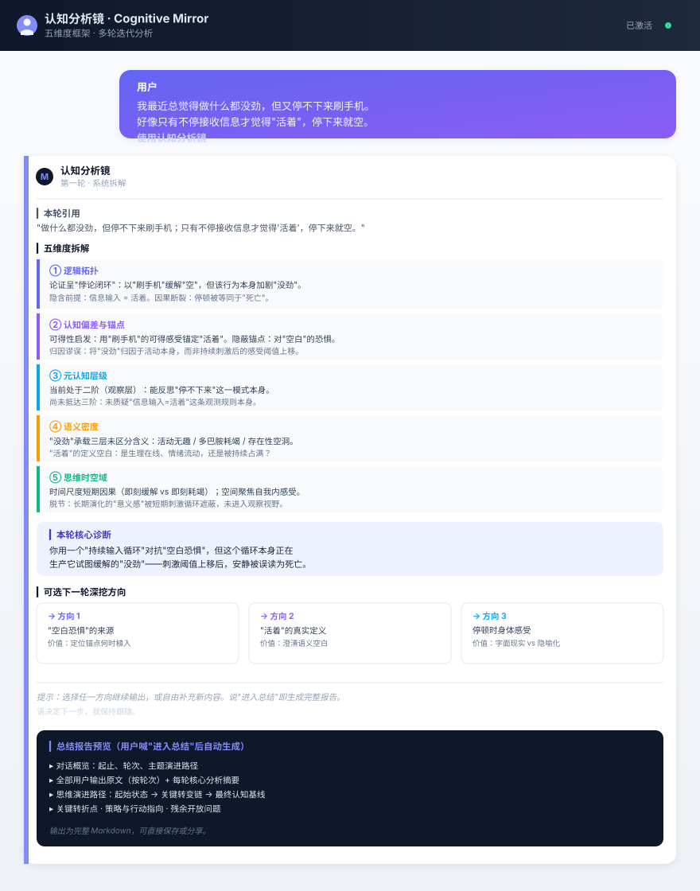

# 认知分析镜（Cognitive Mirror）

> 一个 WorkBuddy 技能（Skill），用于深度认知分析的对话式工具。

把 AI 变成一面认知镜子——你输出想法，它拆解你的思维结构，逐轮迭代，直到你看清自己。



---

## 两个版本

本仓库提供两个版本，按需选择：

| | **V1（标准版）** | **V2（增强版）** |
|---|---|---|
| 定位 | 被动复述与拆解 | 主动创造型介入 |
| 分析维度 | 5 维度 | 7 维度（新增身份回响、框架考古） |
| 核心原则 | 6 条 | 9 条（新增创造型介入、身份意识、框架考古） |
| 每轮步骤 | 6 步 | 8 步（新增未言连接、框架挑战） |
| 总结报告 | 标准格式 | 新增身份/经历连接图谱、被质疑的框架 |
| 上下文占用 | 较低 | 较高 |
| 目录 | `cognitive-mirror/` | `cognitive-mirror-v2/` |

**怎么选**：

- **V1** 适合较灵活的 agent——它能自主追问、主动连接上下文、质疑用户框架，框架本身只规定"拆什么"，把"怎么追问"交给 agent 的判断力。
- **V2 适合不那么灵活的 agent**——它把"主动质疑、连接未言明内容、框架考古"这些原本依赖 agent 灵活性的能力，显式写成规则和步骤（每轮必须执行未言连接、框架挑战），降低对 agent 自身灵活性的依赖。**代价是占用上下文较多**（7 维度 + 9 原则 + 8 步流程）。

> 两个版本的触发词、反向触发条件、场景识别规则一致，可共存安装。

---

## 它是什么

「认知分析镜」不是一次性问答工具，而是一个**多轮迭代分析流程**：

1. 你发任何内容（想法、困惑、情绪记录、推演）+ 说一句"认知分析"或"使用认知分析镜"
2. AI 从多个维度系统拆解你的表述
3. 给出本轮诊断 + 3 个可选的深挖方向
4. 你选方向继续说，或自由补充
5. 循环到你说"进入总结"，自动生成完整 Markdown 报告

核心理念：**认知澄清是迭代过程，关键跃迁发生在你对前一轮分析的修正中。**

---

## 分析框架

### V1：五维度

| 维度 | 拆解什么 |
|------|---------|
| **逻辑拓扑** | 论证结构（树状/线性/辩证循环）、隐含前提、因果断裂 |
| **认知偏差与锚点** | 确认偏误、框架效应、归因谬误，以及驱动思考的隐蔽锚点 |
| **元认知层级** | 你在现象层（陈述）、观察层（反思自身）、还是重构层（改变观测规则） |
| **语义密度** | 关键词的抽象层级、语义模糊点、你未意识到的定义空白 |
| **思维时空域** | 时间尺度（短期/长期）、空间尺度（自我/环境/全景）、宏微观脱节 |

### V2：七维度（在 V1 基础上新增两个）

| 新增维度 | 拆解什么 |
|---------|---------|
| **身份回响** | 你的当前思维与已知身份/经历之间是否存在共振或张力？底层驱动力是否连接到学习阶段、创作实践、审美形成史？ |
| **框架考古** | 你当前接受了哪些概念框架？它们的来源和边界在哪？是否存在替代框架能打开不同角度？ |

---

## 安装

### V1（标准版）

1. 把 `cognitive-mirror` 文件夹放到：

```
C:\你的用户名\.workbuddy\skills\
```

> 没有 `skills` 文件夹就新建一个。最终路径应为：
> `.workbuddy\skills\cognitive-mirror\SKILL.md`

2. 重启 WorkBuddy

### V2（增强版）

1. 把 `cognitive-mirror-v2` 文件夹放到同一位置：

```
C:\你的用户名\.workbuddy\skills\
```

> 最终路径应为：
> `.workbuddy\skills\cognitive-mirror-v2\SKILL.md`

2. 重启 WorkBuddy

### 从源码安装

```bash
git clone https://github.com/zegreen-Z/cognitive-mirror-skill.git
cp -r cognitive-mirror-skill/cognitive-mirror ~/.workbuddy/skills/      # V1
cp -r cognitive-mirror-skill/cognitive-mirror-v2 ~/.workbuddy/skills/   # V2
```

### 项目级安装（团队共享）

把对应文件夹放到项目的 `.workbuddy/skills/` 下，push 到仓库，协作者 pull 后自动获得。

---

## 使用方法

### 触发

在 WorkBuddy 对话中发送任意内容，加上以下任一触发词：

```
使用认知分析镜
开始认知分析
认知分析
analyze my thinking
```

> **注意**："认知分析"单独使用即有效，是"开始认知分析"的简短形式。

### 场景识别

不仅限于直接说"分析我的思维"。当你在**讨论书籍/文章/影视/同人/游戏等作品**时，如果表达中包含审美判断、价值观表达、自我探索信号（如"我适合做X吗"）、对比归类或元层面反思，也会被识别为认知分析请求——作品是思维模式的载体。

### 示例对话

```
你：我最近总觉得做什么都没劲，但又停不下来刷手机。使用认知分析镜

AI：✅ 认知分析镜已激活
    [完整引用你的原文]
    [多维度拆解]
    本轮核心诊断：...
    三个深挖方向：
      1. ...（价值：...）
      2. ...（价值：...）
      3. ...（价值：...）
    请决定下一步，我保持跟随。

你：选方向 2，再补充一点……

AI：[迭代分析，校准坐标]
    ……

（重复若干轮）

你：进入总结

AI：[输出完整 Markdown 总结报告]
```

### 终止

随时说以下任一句，AI 会整理全部对话并生成总结报告：

- `进入总结`
- `停，总结`

---

## 总结报告包含

- **对话概览**：起止、轮次、主题演进
- **全部用户输出原文**（按轮次）+ 每轮核心分析摘要
- **思维演进路径**：从起始状态到最终状态的转变链
- **最终认知基线**：多轮校准后的核心结论
- **关键转折点**：2-4 次最重要的自我校正或认知跃升
- **策略与行动指向**：未来可采取的方向
- **残余开放问题**：未收敛的待探索项
- **（V2 新增）身份/经历连接图谱**：思维模式 ↔ 可能的身份/经历来源
- **（V2 新增）被质疑的框架**：对话中被挑战、修正或替换的概念框架

---

## 安全声明

- 本技能**不构成心理诊断或医疗建议**，不是心理咨询替代品。
- 你才是自身认知的最终权威，AI 的解释遇到你的自我校正时自动降级。
- 分析风格保持客观、精确、不评判。
- （V2）当推测思维与身份/经历的关系时，始终以开放式假设呈现，不做确定性断言。你有权拒绝任何推测。

---

## 技能结构

```
cognitive-mirror/
└── SKILL.md              # V1 标准版：5 维度，6 原则，被动复述拆解

cognitive-mirror-v2/
└── SKILL.md              # V2 增强版：7 维度，9 原则，主动创造型介入
                          # 含未言连接、框架挑战、身份回响
                          # 适合不灵活的 agent，占用上下文较多
```

纯单文件技能，无脚本、无外部依赖，安装即用。

---

## 技能来源

本技能模板基于一次真实的多轮认知分析对话抽象提炼而成。该对话中用户从"AI 时代个人焦虑"出发，经过 11 轮迭代，依次完成了对"外扩-内缩消耗"、"生存压力锚点"、"沉浸学习功能消失"等深层结构的校准与确认。本技能保留了该对话中验证有效的全部分析方法和对话管理规则。

V2 在 V1 基础上，引入了"创造型介入""身份意识""框架考古"三项核心增强，并新增"身份回响""框架考古"两个分析维度，适用于需要更主动、更结构化分析的 agent 环境。

---

## License

[CC BY-SA 4.0](https://creativecommons.org/licenses/by-sa/4.0/)（Creative Commons Attribution-ShareAlike 4.0 International）

Copyright (c) 2026 认知分析镜（Cognitive Mirror）

本仓库内容依据 CC BY-SA 4.0 协议授权：可自由使用、修改、分发，但须署名，且衍生作品须以相同协议（CC BY-SA 4.0）发布——不允许闭源再分发。详见[协议全文](https://creativecommons.org/licenses/by-sa/4.0/legalcode)。
